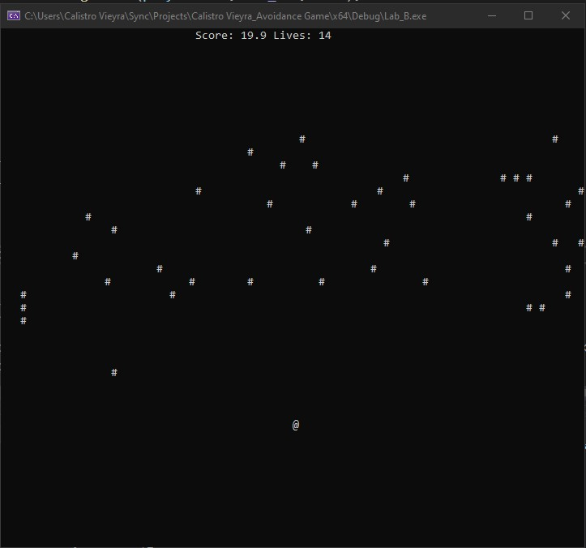

# Avoidance_Game

• Here I coded an avoidance game where you as the player will be represented as the ‘@’ symbol.

• There will be ‘#’ symbols falling from the top of the screen and your mission is to avoid being hit by them.

• You will have so many lives and a score counter that increases as you dodge the obstacles ‘#’.

• You will use the left, right, up, and down arrows to move the player.

• If you wish to save your high scores they will be saved to a “Player Stats.txt” file that is automatically generated into the “Lab_B” folder with all the other main files. By leaving the “Player Stats.txt” file in its folder, the program will automatically read this in upon start up and display high scores if chose to do so.
